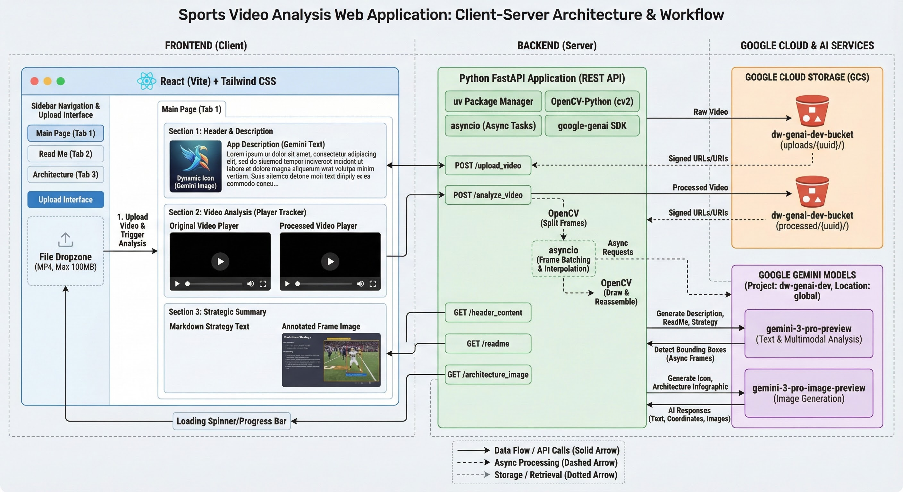

# Sports Video Analysis App

This application allows users to upload sports videos, analyze them using Google's Gemini AI to detect players, and receive a strategic summary of the video content.

## Architecture



## Prerequisites

- Python 3.11+
- Node.js 18+
- Google Cloud CLI configured with access to the `your project id` project.
- Authenticated with Google Cloud: `gcloud auth application-default login`

## Project Structure

- `backend/`: FastAPI application
- `frontend/`: React (Vite) application

## Setup & Run

### 1. Backend

Navigate to the backend directory, install dependencies, and run the server.

```bash
cd backend
uv sync
uv run python main.py
```

The backend will run on `http://localhost:8000`.

### 2. Frontend

Navigate to the frontend directory, install dependencies, and run the development server.

```bash
cd frontend
npm install
npm run dev
```

The frontend will run on `http://localhost:5173` (or check the output for the correct port).

## Features

- **Main Page**: Upload videos, view original and processed videos side-by-side, and see a strategic summary.
- **Read Me**: Dynamic README generated by Gemini.
- **Architecture**: System architecture diagram generated by Gemini.
